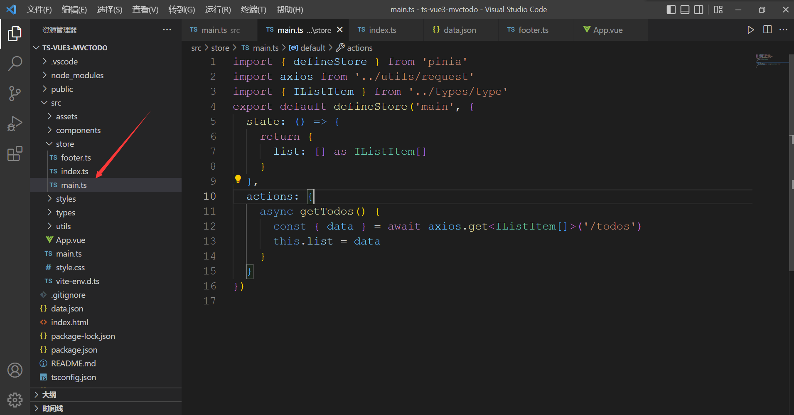

# Pinia（状态管理、vuex 的下个版本）

```
// pinia基本使用
main.js:


vue2:
如果使用 Vue 2 还需要安装组合 API：@vue/composition-api
import { createPinia, PiniaVuePlugin } from 'pinia'
Vue.use(PiniaVuePlugin)
const pinia = createPinia()
new Vue({
  el: '#app',
  pinia
})

vue3:
import { createStore } from 'pinia'
const store = createStore()
createApp(App).use(storePinia).mount('#app')


store:

  exampleStore:
  import { defineStore } from 'pinia'
  export default defineStore('main', { // main->key值
  state: () => {
    return {
      list: []
    }
  },
  actions: {
     getTodos() {
      ...
    }
  }
})

```


