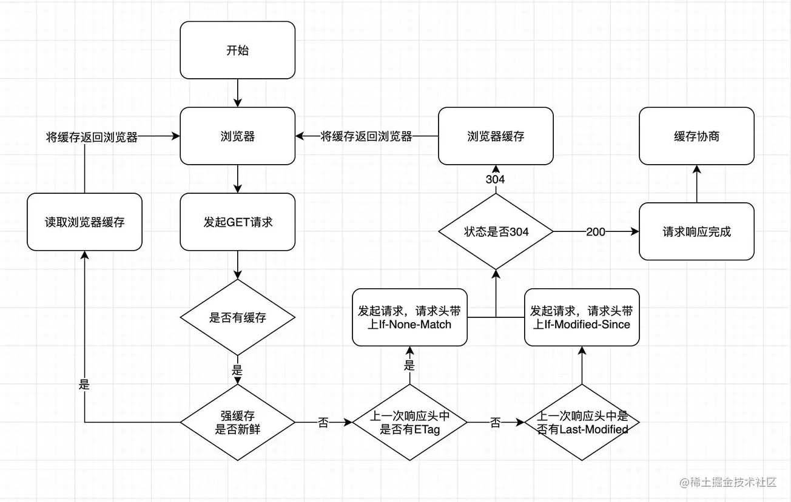

## http 强缓存和协商缓

如果需要开启缓存机制，http响应头中需要添加Expires、Cache-Control、pragma

Expires:
Expires的值是一个日期,但由于是服务器的时间跟本地系统的时间比较会存在缓存有效期不准的问题(基本上来说不用了)

Cache-Control(常用值,默认为private):
**private**  客户端可以缓存
**public**   客户端、代理服务器都可以缓存
**max-age=xx**  设置缓存的过期时间（单位：秒）
**no-cache**  设置协商缓存
**no-store**  不用缓存策略

Pragma:只有一个no-cache的值

优先级:Pragma>Cache-Control>Expires

## http强缓存
不需要发送请求到服务端，直接读取浏览器本地缓存,是否是强缓存，由Expires、Cache-Control、Pragma决定

## http协商缓存

资源标识符
ETag/IF-NONE-MATCH: ETag的值是一串Hash码，代表资源的标识符，如果资源发生改变，hash码也会发生改变，反之则不变。如果http请求头里有IF-NONE-MATCH属性，则会跟服务器的ETag比较，如果不变则返回304状态码，告知客户端继续使用缓存,否则就返回资源和新的ETag。

Last-Modified/IF-Modified-Since: Last-Modified的值是一资源最后修改的时间, 如果HTTP请求头里有IF-Modified-Since属性，则会跟服务器的Last-Modified进行比较，如果服务器的Last-Modified <= IF-Modified-Since则返回304，告知客户端继续使用缓存，反之则返回资源和最新的资源更改时间

